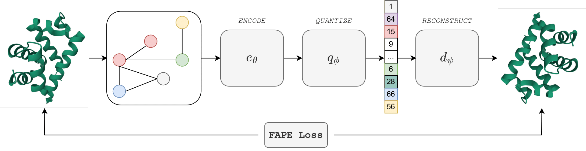
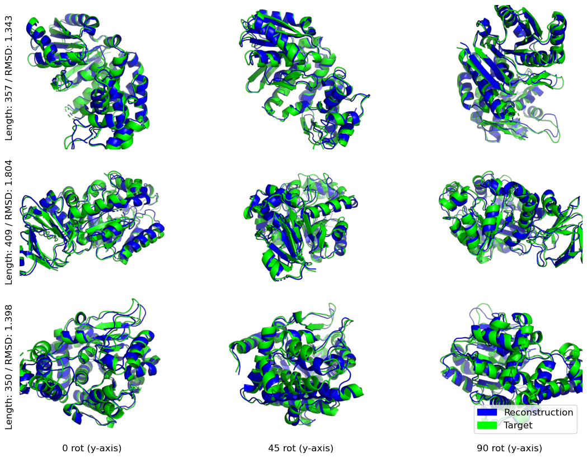

# Learning the Language of Protein Structure

This is a general notice for the public release of the implementation of the paper
[Learning the Language of Protein Structures](https://arxiv.org/abs/2405.15840).


## Abstract
Representation learning and _de novo_ generation of proteins are pivotal computational biology tasks. 
Whilst natural language processing (NLP) techniques have proven highly effective for protein sequence modelling, structure modelling presents a complex challenge, primarily due to its continuous and three-dimensional nature.  
Motivated by this discrepancy, we introduce an approach using a vector-quantized autoencoder that effectively tokenizes protein structures into discrete representations. 
This method transforms the continuous, complex space of protein structures into a manageable, discrete format with a codebook ranging from 4096 to 64000 tokens, achieving high-fidelity reconstructions with backbone root mean square deviations (RMSD) of approximately 1-5 $\overset{\circ}{\text{A}}$. 
To demonstrate the efficacy of our learned representations, we show that a simple GPT model trained on our codebooks can generate novel, diverse, and designable protein structures. 
Our approach not only provides representations of protein structure, but also mitigates the challenges of disparate modal representations and sets a foundation for seamless, multi-modal integration, enhancing the capabilities of computational methods in protein design.

## Schematic overview

We learn in this work a protein structure autoencoder.  
Our encoder views protein structures as graphs to be encoded in a discrete space.




## Reconstruction examples
Samples are well encoded in the sequence space, and can easily be mapped back into the space of structures with low error.


## Generation examples
Because we access a sequence instead of structures, we can learn a generative model to sample protein structures.
For instance :


## Repo Description

The main repos entries are located in the `scripts` folder as follows:

```plaintext
protein-structure-tokenizer/
├── scripts /
│   ├── lm/    # utilitaries for the GPT model
│   └── decode_tokens.py 
│   └── tokenize_pdb.py
│   └── gpt_generation.py
└── README.md
```


## Use Cases

### Docker
We provide a `dockerfile` in order to smoothly reproduce our results along with a `Makefile`.
Before building the container don't forget to set the variable named `ACCELERATOR` in the `Makefile`, specifying the type of accelerator / device to run on.
The allowed options are `TPU`, `GPU`, `CPU`.

Encoding structures and decoding tokens has been tested on `CPU`, `GPU` and `TPU`.
For performance reasons we have only tested GPT generation on `GPU` and `TPU`.

### Tokenize a structure

The script to "tokenize" a structure is `tokenize_pdb` that takes as input a `pdb_dir`
and a `tokens_save_path`. 

It can be invoked as:

```bash
python scripts/tokenize_pdb.py --pdb_dir=casp14_pdbs \
                               --token_save_path=casp_14_tokens
```

We include some casp14 structures to provide the user with some structures to 
test our code.

### Estimate a structure from tokens

Similarly we provide an entry point for decoding tokens and estimate the associated
structure. For instance:

```bash
python scripts/decode_tokens.py --structure_save_path=casp14_pdbs_decoded\
                                --tokens_dir=casp_14_tokens
```
For both scripts, some parameters can be specified using the command line.

For instance: the `codebook_size`, `downsampling_ratio` and the `batch_size_per_device` are customizable from the commandlines.


Other parameters (that involved more) are directly to modified in the appropriate `.yaml` file in the `config/` folder.


### Generate a sequence of structure

We proposed in our work to generate structural tokens sequences using a transformer decoder only model trained on a next-token-prediction objecive.

To generate a sequence of structural tokens, we use `scripts/gpt_generation.py` script. 

Again, the command line parameters are very generic ( `codebook_size`, `downsampling_ratio` and the `batch_size_per_device`).
To modify the sampling parameter, consider changing an entry in `config/sampling/sampling.yaml`.

Note that `GPT`-like generation on `CPU` might not be feasible.

## Pretrained model weights
Model weights are accessible using HuggingFace Hub.

### Encoder - Quantizer - Decoder

```python
from huggingface_hub import hf_hub_download
from scripts.inference_runner import InferenceRunner
import jax

devices = jax.devices(BACKEND)

# this downloads the actual weights from the HF hub
params = hf_hub_download(
    repo_id="InstaDeepAI/protein-structure-tokenizer", 
    filename="4k_df_1/params.npz",
    local_dir="weights"
    )

# this downloads the parameters description.
info = hf_hub_download(
    repo_id="InstaDeepAI/protein-structure-tokenizer", 
    filename="4k_df_1/state_variables.npy",
    local_dir="weights",
)
# both are saved in a nice PATH: "weights/4k_df_1/"
# you can give this path to the InferenceRunner or load the weights as:
params = InferenceRunner.load_params(PATH, local_devices=devices)
```

### Performance to expect

We report here mean reconstruction performances on CASP14 for various codebook sizes and downsampling ratios obtained on CPU using the publicly released weights.

| Downsampling Ratio | Codebook Size | RMSD | TM Score |
|--------------------|---------------|------|----------|
| 1                  | 432           | 1.69 | 0.89     |
| 1                  | 1728          | 1.54 | 0.92     |
| 1                  | 4096          | 1.23 | 0.94     |
| 1                  | 64000         | 0.97 | 0.94     |
| 2                  | 4096          | 1.79 | 0.72     |
| 2                  | 64000         | 1.70 | 0.92     |
| 4                  | 4096          | 3.11 | 0.72     |
| 4                  | 64000         | 2.70 | 0.78     |


### Decoder-only
In a similar fashion, the gpt model parameters are accessible :

```python
from huggingface_hub import hf_hub_download
import jax
from scripts.gpt_generation import load_params

devices = jax.devices(BACKEND)

# this downloads the actual weights from the HF hub
params_path = hf_hub_download(
    repo_id="InstaDeepAI/protein-structure-tokenizer", 
    filename="gpt_4k_df_1/params.joblib",
    local_dir="weights"
    )

params = load_params(params_path)
```


## Citing us
To cite our work:

```
@misc{gaujac2024learninglanguageproteinstructure,
      title={Learning the Language of Protein Structure}, 
      author={Benoit Gaujac and Jérémie Donà and Liviu Copoiu and Timothy Atkinson and Thomas Pierrot and Thomas D. Barrett},
      year={2024},
      eprint={2405.15840},
      archivePrefix={arXiv},
      primaryClass={q-bio.QM},
      url={https://arxiv.org/abs/2405.15840}, 
}
```

